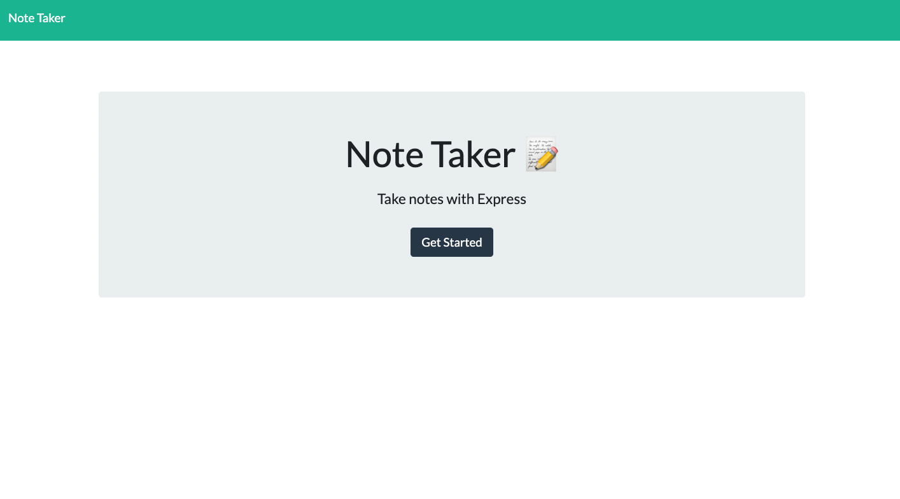

# Note Taker app

## Table of contents

### [Description](#description)

### [Installation](#installation)

### [Media](#media)

### [License](#license)

### [URL](#application)

### [Questions](#questions)

## Description

For this app you can take notes and it will be saved

## Installation

just vist the link!

## Media

## Credits

JacksonGrimm
https://github.com/JacksonGrimm

## License

MIT License

## Application URL

https://note-taker-express-db.herokuapp.com/notes

## Questions

if you have any questions got to me github profile to contact me
https://github.com/JacksonGrimm
